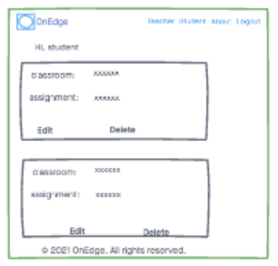
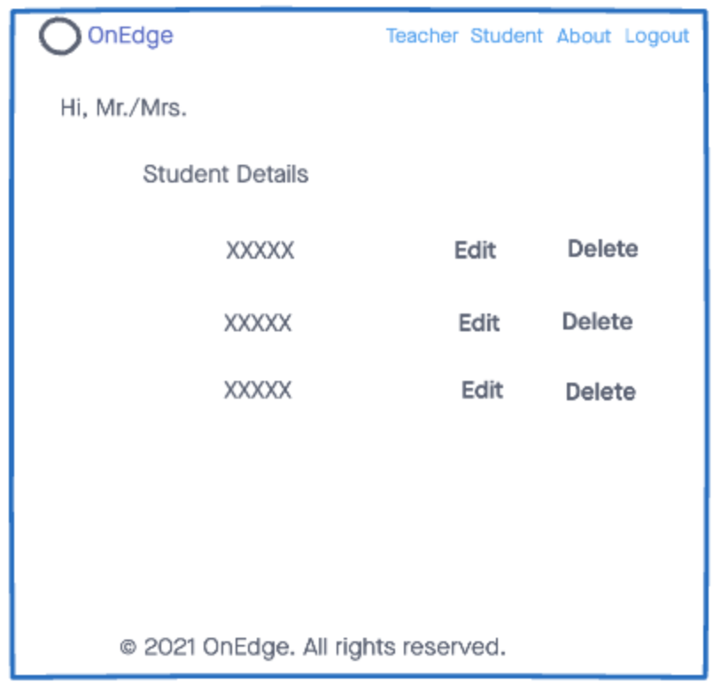

# OnEdge

An online learning tool that provides a platform for teachers and students to communicate effectively with each other.

## Getting Started
[Click Here](https://onedgeweb.herokuapp.com/) to get started on Heroku

## Technologies
- Python
- Django
- Postgresql
- HTML5
- CSS3
- JavaScript
- Materialize CSS

## Pitch Deck 
[Click Here](https://docs.google.com/presentation/d/1ojbgg5riQrEt0-XKnMVf6qMkp4Y1veR66myL-KFEHpA/edit#slide=id.ge30410d274_0_185) to see our pitch deck

## Trello Board
[Click Here](https://trello.com/b/ILQukgDu/onedge) to see our Trello Board

## Initial Wireframes

## ERDs

## Screenshots

## Future Enhancements
- Mobile Responsiveness
- Allow a teacher to upload a file as attachment to an assignment

## Unsolved Problems
- Connecting students to a the student profile
- Allowing a teacher user to upload their photo

## Biggest Challenge
- Creating two different profile types
- Git workflow (migrations)
